# Supabase Database Integration Design

## Overview

This design document outlines the integration of Supabase as the database backend for the qoder-v3 Spring Boot application. Supabase provides a managed PostgreSQL database with additional features like real-time subscriptions, authentication, and storage. The integration leverages existing PostgreSQL dependencies and Flyway migration capabilities while adding Supabase-specific configurations.

## Architecture

### Database Architecture
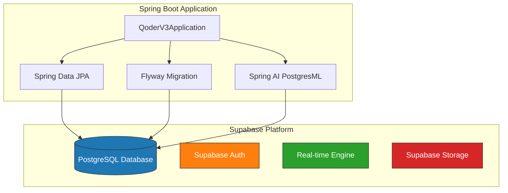

### Component Integration Flow
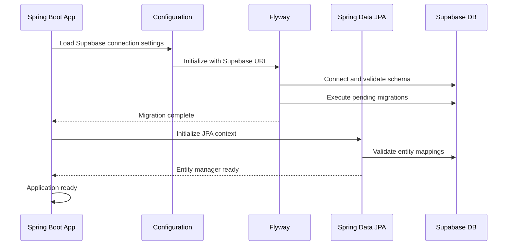

## Database Configuration

### Connection Properties
The application.properties file needs to be updated with Supabase-specific connection details:

```properties
# Application Identity
spring.application.name=qoder-v3

# Supabase Database Configuration
spring.datasource.url=jdbc:postgresql://[SUPABASE_HOST]:5432/postgres
spring.datasource.username=[SUPABASE_USERNAME]
spring.datasource.password=[SUPABASE_PASSWORD]
spring.datasource.driver-class-name=org.postgresql.Driver

# Connection Pool Configuration
spring.datasource.hikari.maximum-pool-size=10
spring.datasource.hikari.minimum-idle=2
spring.datasource.hikari.connection-timeout=30000
spring.datasource.hikari.idle-timeout=600000
spring.datasource.hikari.max-lifetime=1800000

# JPA Configuration for Supabase
spring.jpa.database-platform=org.hibernate.dialect.PostgreSQLDialect
spring.jpa.hibernate.ddl-auto=validate
spring.jpa.show-sql=false
spring.jpa.properties.hibernate.format_sql=true
spring.jpa.properties.hibernate.default_schema=public

# Flyway Configuration
spring.flyway.enabled=true
spring.flyway.baseline-on-migrate=true
spring.flyway.locations=classpath:db/migration
spring.flyway.schemas=public
```

### Environment-Specific Configuration
For different environments, create separate property files:

**application-development.properties**
```properties
spring.jpa.show-sql=true
spring.flyway.clean-disabled=false
logging.level.org.flywaydb=DEBUG
```

**application-production.properties**
```properties
spring.jpa.show-sql=false
spring.flyway.clean-disabled=true
spring.datasource.hikari.maximum-pool-size=20
```

## Migration Strategy

### Directory Structure
```
src/main/resources/
├── db/
│   └── migration/
│       ├── V1__init_schema.sql
│       ├── V2__create_users_table.sql
│       ├── V3__create_projects_table.sql
│       └── V4__add_ai_embeddings_extension.sql
└── application.properties
```

### Initial Migration Scripts

**V1__init_schema.sql**
```sql
-- Enable required extensions for Supabase
CREATE EXTENSION IF NOT EXISTS "uuid-ossp";
CREATE EXTENSION IF NOT EXISTS "pgcrypto";

-- Create application schema
CREATE SCHEMA IF NOT EXISTS qoder_v3;
```

**V2__create_users_table.sql**
```sql
CREATE TABLE qoder_v3.users (
    id UUID PRIMARY KEY DEFAULT uuid_generate_v4(),
    email VARCHAR(255) UNIQUE NOT NULL,
    username VARCHAR(50) UNIQUE NOT NULL,
    full_name VARCHAR(255),
    avatar_url TEXT,
    created_at TIMESTAMP WITH TIME ZONE DEFAULT NOW(),
    updated_at TIMESTAMP WITH TIME ZONE DEFAULT NOW()
);

-- Create index for faster lookups
CREATE INDEX idx_users_email ON qoder_v3.users(email);
CREATE INDEX idx_users_username ON qoder_v3.users(username);
```

**V3__create_projects_table.sql**
```sql
CREATE TABLE qoder_v3.projects (
    id UUID PRIMARY KEY DEFAULT uuid_generate_v4(),
    name VARCHAR(255) NOT NULL,
    description TEXT,
    owner_id UUID NOT NULL REFERENCES qoder_v3.users(id) ON DELETE CASCADE,
    repository_url TEXT,
    status VARCHAR(50) DEFAULT 'active',
    created_at TIMESTAMP WITH TIME ZONE DEFAULT NOW(),
    updated_at TIMESTAMP WITH TIME ZONE DEFAULT NOW()
);

-- Create indexes
CREATE INDEX idx_projects_owner_id ON qoder_v3.projects(owner_id);
CREATE INDEX idx_projects_status ON qoder_v3.projects(status);
```

**V4__add_ai_embeddings_extension.sql**
```sql
-- Enable vector extension for AI embeddings (if available in Supabase)
CREATE EXTENSION IF NOT EXISTS vector;

-- Create embeddings table for AI features
CREATE TABLE qoder_v3.embeddings (
    id UUID PRIMARY KEY DEFAULT uuid_generate_v4(),
    content_id UUID NOT NULL,
    content_type VARCHAR(50) NOT NULL,
    embedding_vector vector(1536),
    metadata JSONB,
    created_at TIMESTAMP WITH TIME ZONE DEFAULT NOW()
);

-- Create index for vector similarity search
CREATE INDEX idx_embeddings_vector ON qoder_v3.embeddings 
USING ivfflat (embedding_vector vector_cosine_ops) WITH (lists = 100);
```

## Data Models & JPA Entities

### User Entity
```java
@Entity
@Table(name = "users", schema = "qoder_v3")
@Data
@NoArgsConstructor
@AllArgsConstructor
public class User {
    @Id
    @GeneratedValue
    @Column(columnDefinition = "uuid")
    private UUID id;
    
    @Column(unique = true, nullable = false)
    private String email;
    
    @Column(unique = true, nullable = false)
    private String username;
    
    @Column(name = "full_name")
    private String fullName;
    
    @Column(name = "avatar_url")
    private String avatarUrl;
    
    @CreationTimestamp
    @Column(name = "created_at")
    private Instant createdAt;
    
    @UpdateTimestamp
    @Column(name = "updated_at")
    private Instant updatedAt;
    
    @OneToMany(mappedBy = "owner", cascade = CascadeType.ALL)
    private List<Project> projects = new ArrayList<>();
}
```

### Project Entity
```java
@Entity
@Table(name = "projects", schema = "qoder_v3")
@Data
@NoArgsConstructor
@AllArgsConstructor
public class Project {
    @Id
    @GeneratedValue
    @Column(columnDefinition = "uuid")
    private UUID id;
    
    @Column(nullable = false)
    private String name;
    
    private String description;
    
    @ManyToOne(fetch = FetchType.LAZY)
    @JoinColumn(name = "owner_id", nullable = false)
    private User owner;
    
    @Column(name = "repository_url")
    private String repositoryUrl;
    
    @Enumerated(EnumType.STRING)
    private ProjectStatus status = ProjectStatus.ACTIVE;
    
    @CreationTimestamp
    @Column(name = "created_at")
    private Instant createdAt;
    
    @UpdateTimestamp
    @Column(name = "updated_at")
    private Instant updatedAt;
}
```

## Security & Authentication Integration

### Supabase Authentication Configuration
```properties
# OAuth2 Configuration for Supabase Auth
spring.security.oauth2.client.registration.supabase.client-id=[SUPABASE_CLIENT_ID]
spring.security.oauth2.client.registration.supabase.client-secret=[SUPABASE_CLIENT_SECRET]
spring.security.oauth2.client.registration.supabase.authorization-grant-type=authorization_code
spring.security.oauth2.client.registration.supabase.redirect-uri={baseUrl}/login/oauth2/code/supabase
spring.security.oauth2.client.registration.supabase.scope=openid,email,profile

spring.security.oauth2.client.provider.supabase.authorization-uri=https://[PROJECT_ID].supabase.co/auth/v1/authorize
spring.security.oauth2.client.provider.supabase.token-uri=https://[PROJECT_ID].supabase.co/auth/v1/token
spring.security.oauth2.client.provider.supabase.user-info-uri=https://[PROJECT_ID].supabase.co/auth/v1/user
spring.security.oauth2.client.provider.supabase.jwk-set-uri=https://[PROJECT_ID].supabase.co/auth/v1/jwks
```

### Row Level Security (RLS)
Enable RLS policies in Supabase for enhanced security:

```sql
-- Enable RLS on users table
ALTER TABLE qoder_v3.users ENABLE ROW LEVEL SECURITY;

-- Policy: Users can only read/update their own record
CREATE POLICY user_access_policy ON qoder_v3.users
    FOR ALL USING (auth.uid() = id);

-- Enable RLS on projects table
ALTER TABLE qoder_v3.projects ENABLE ROW LEVEL SECURITY;

-- Policy: Users can only access their own projects
CREATE POLICY project_access_policy ON qoder_v3.projects
    FOR ALL USING (auth.uid() = owner_id);
```

## AI Integration with PostgresML

### Vector Storage Configuration
```java
@Entity
@Table(name = "embeddings", schema = "qoder_v3")
public class Embedding {
    @Id
    @GeneratedValue
    private UUID id;
    
    @Column(name = "content_id")
    private UUID contentId;
    
    @Column(name = "content_type")
    private String contentType;
    
    @Column(name = "embedding_vector", columnDefinition = "vector(1536)")
    private String embeddingVector;
    
    @Column(columnDefinition = "jsonb")
    private String metadata;
    
    @CreationTimestamp
    @Column(name = "created_at")
    private Instant createdAt;
}
```

### AI Service Integration
```java
@Service
public class EmbeddingService {
    
    @Autowired
    private EmbeddingRepository embeddingRepository;
    
    @Autowired
    private EmbeddingClient embeddingClient;
    
    public void generate# Supabase Database Integration Design

## Overview

This design document outlines the integration of Supabase (PostgreSQL) database with the qoder-v3 Spring Boot application. The integration involves configuring the datasource, setting up Flyway migrations, and ensuring proper connection pooling for the cloud-hosted PostgreSQL instance.

## Architecture

### Database Connection Architecture

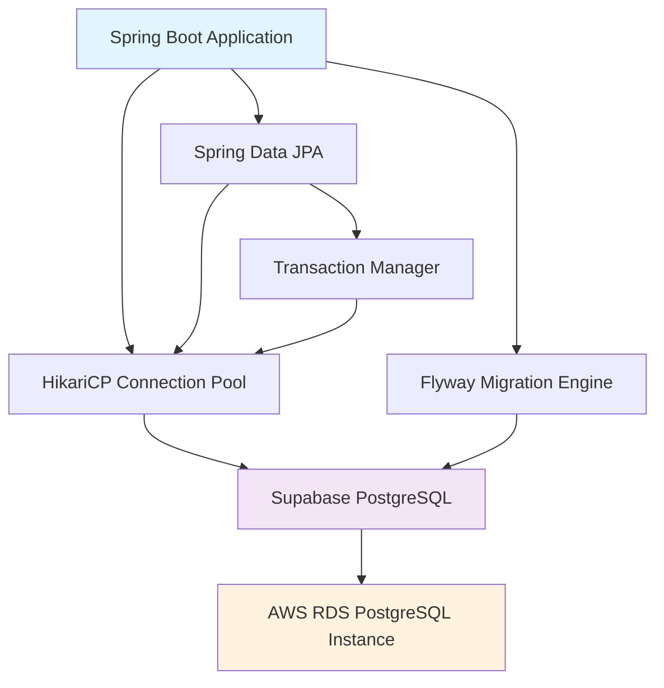

### Connection Flow

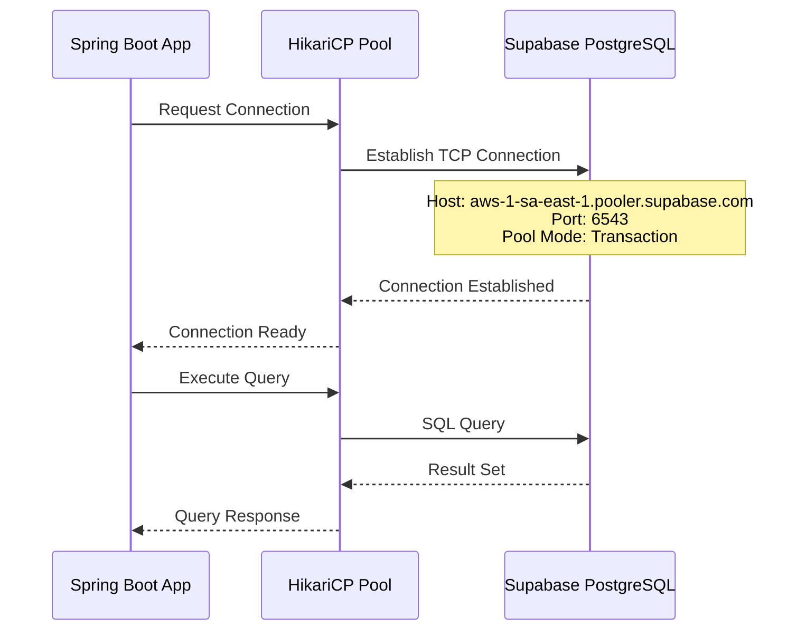

## Database Configuration

### Application Properties Setup

The following configuration will be added to `src/main/resources/application.properties`:

```properties
# Supabase Database Configuration
spring.datasource.url=jdbc:postgresql://aws-1-sa-east-1.pooler.supabase.com:6543/postgres
spring.datasource.username=postgres.kmcuhicgzwdcalnyywgo
spring.datasource.password=Eliasz9172$
spring.datasource.driver-class-name=org.postgresql.Driver

# Connection Pool Configuration (HikariCP)
spring.datasource.hikari.connection-timeout=20000
spring.datasource.hikari.maximum-pool-size=10
spring.datasource.hikari.minimum-idle=2
spring.datasource.hikari.idle-timeout=300000
spring.datasource.hikari.max-lifetime=1200000
spring.datasource.hikari.leak-detection-threshold=60000

# JPA Configuration
spring.jpa.database-platform=org.hibernate.dialect.PostgreSQLDialect
spring.jpa.hibernate.ddl-auto=validate
spring.jpa.show-sql=false
spring.jpa.properties.hibernate.format_sql=true
spring.jpa.properties.hibernate.jdbc.time_zone=UTC

# Flyway Migration Configuration
spring.flyway.enabled=true
spring.flyway.locations=classpath:db/migration
spring.flyway.baseline-on-migrate=true
spring.flyway.validate-on-migrate=true
```

### Environment-Specific Configuration

For production security, sensitive credentials should be externalized:

```properties
# Production Configuration (using environment variables)
spring.datasource.url=${DATABASE_URL:jdbc:postgresql://aws-1-sa-east-1.pooler.supabase.com:6543/postgres}
spring.datasource.username=${DATABASE_USER:postgres.kmcuhicgzwdcalnyywgo}
spring.datasource.password=${DATABASE_PASSWORD}
```

## Migration Strategy

### Directory Structure

```
src/main/resources/
└── db/
    └── migration/
        ├── V1__init_schema.sql
        ├── V2__create_users_table.sql
        ├── V3__create_roles_table.sql
        └── V4__add_user_roles_relationship.sql
```

### Migration Execution Flow

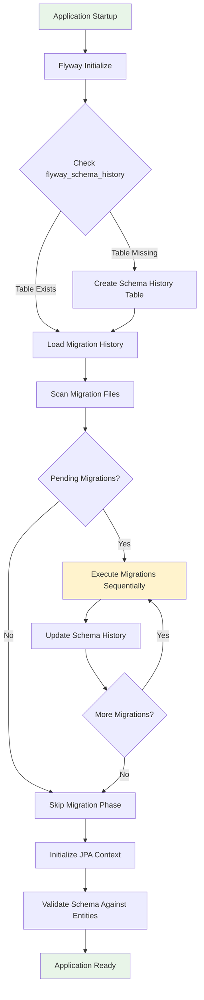

### Sample Migration Scripts

**V1__init_schema.sql**
```sql
-- Initial schema setup
CREATE EXTENSION IF NOT EXISTS "uuid-ossp";
CREATE EXTENSION IF NOT EXISTS "pgcrypto";

-- Create audit columns function
CREATE OR REPLACE FUNCTION trigger_set_timestamp()
RETURNS TRIGGER AS $$
BEGIN
  NEW.updated_at = NOW();
  RETURN NEW;
END;
$$ LANGUAGE plpgsql;
```

**V2__create_users_table.sql**
```sql
-- Users table
CREATE TABLE users (
    id UUID PRIMARY KEY DEFAULT uuid_generate_v4(),
    username VARCHAR(50) UNIQUE NOT NULL,
    email VARCHAR(100) UNIQUE NOT NULL,
    password_hash VARCHAR(255) NOT NULL,
    first_name VARCHAR(50),
    last_name VARCHAR(50),
    is_active BOOLEAN DEFAULT true,
    created_at TIMESTAMP WITH TIME ZONE DEFAULT NOW(),
    updated_at TIMESTAMP WITH TIME ZONE DEFAULT NOW()
);

-- Add update trigger
CREATE TRIGGER set_timestamp
    BEFORE UPDATE ON users
    FOR EACH ROW
    EXECUTE PROCEDURE trigger_set_timestamp();

-- Add indexes
CREATE INDEX idx_users_username ON users(username);
CREATE INDEX idx_users_email ON users(email);
CREATE INDEX idx_users_active ON users(is_active);
```

## Data Models & JPA Mapping

### User Entity Example

```java
@Entity
@Table(name = "users")
@Data
@NoArgsConstructor
@AllArgsConstructor
public class User {
    
    @Id
    @GeneratedValue(strategy = GenerationType.AUTO)
    @Column(columnDefinition = "UUID")
    private UUID id;
    
    @Column(name = "username", unique = true, nullable = false, length = 50)
    private String username;
    
    @Column(name = "email", unique = true, nullable = false, length = 100)
    private String email;
    
    @Column(name = "password_hash", nullable = false)
    private String passwordHash;
    
    @Column(name = "first_name", length = 50)
    private String firstName;
    
    @Column(name = "last_name", length = 50)
    private String lastName;
    
    @Column(name = "is_active")
    private Boolean isActive = true;
    
    @CreationTimestamp
    @Column(name = "created_at", updatable = false)
    private OffsetDateTime createdAt;
    
    @UpdateTimestamp
    @Column(name = "updated_at")
    private OffsetDateTime updatedAt;
}
```

### Repository Layer

```java
@Repository
public interface UserRepository extends JpaRepository<User, UUID> {
    
    Optional<User> findByUsername(String username);
    
    Optional<User> findByEmail(String email);
    
    @Query("SELECT u FROM User u WHERE u.isActive = :active")
    List<User> findByActiveStatus(@Param("active") Boolean active);
    
    @Modifying
    @Query("UPDATE User u SET u.isActive = false WHERE u.id = :id")
    void deactivateUser(@Param("id") UUID id);
}
```

## Connection Pool Optimization

### HikariCP Configuration Matrix

| Parameter | Development | Production | Description |
|-----------|-------------|------------|-------------|
| `maximum-pool-size` | 10 | 20 | Maximum connections in pool |
| `minimum-idle` | 2 | 5 | Minimum idle connections |
| `connection-timeout` | 20000ms | 30000ms | Max wait for connection |
| `idle-timeout` | 300000ms | 600000ms | Max idle time before eviction |
| `max-lifetime` | 1200000ms | 1800000ms | Max connection lifetime |
| `leak-detection-threshold` | 60000ms | 0 (disabled) | Connection leak detection |

### Supabase-Specific Optimizations

```properties
# Supabase Transaction Pooler Optimizations
spring.datasource.hikari.connection-init-sql=SELECT 1
spring.datasource.hikari.validation-timeout=5000
spring.datasource.hikari.initialization-fail-timeout=1

# Connection URL Parameters for Supabase
spring.datasource.url=jdbc:postgresql://aws-1-sa-east-1.pooler.supabase.com:6543/postgres?ApplicationName=qoder-v3&tcpKeepAlive=true&socketTimeout=30
```

## Testing Configuration

### Test Database Setup

```properties
# src/test/resources/application-test.properties
spring.datasource.url=jdbc:h2:mem:testdb;DB_CLOSE_DELAY=-1;DB_CLOSE_ON_EXIT=FALSE
spring.datasource.username=sa
spring.datasource.password=
spring.datasource.driver-class-name=org.h2.Driver
spring.jpa.hibernate.ddl-auto=create-drop
spring.# Supabase Database Integration Design

## Overview

This design document outlines the integration of Supabase PostgreSQL database with the qoder-v3 Spring Boot application. Supabase provides a managed PostgreSQL database with connection pooling, which will serve as the primary data store for the application.

## Architecture

### Database Architecture Pattern
The application follows a **Repository Pattern** with **JPA/Hibernate ORM** integration:

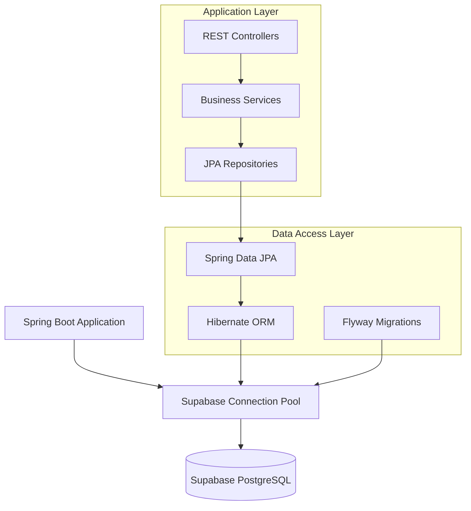

### Connection Architecture
- **Pool Mode**: Transaction-level pooling via Supabase Pooler
- **Connection Management**: Spring Boot HikariCP connection pool
- **Migration Strategy**: Flyway for schema versioning
- **ORM Layer**: Spring Data JPA with Hibernate

## Database Configuration

### Environment-Specific Configuration
The application will use Supabase's managed PostgreSQL instance with the following connection parameters:

| Parameter | Value | Description |
|-----------|-------|-------------|
| Host | aws-1-sa-east-1.pooler.supabase.com | Supabase pooler endpoint |
| Port | 6543 | Transaction pooler port |
| Database | postgres | Default database name |
| Username | postgres.kmcuhicgzwdcalnyywgo | Supabase-generated user |
| Pool Mode | transaction | Connection pooling strategy |

### Spring Boot Configuration Properties

#### Core Database Properties
```properties
# Supabase Database Configuration
spring.datasource.url=jdbc:postgresql://aws-1-sa-east-1.pooler.supabase.com:6543/postgres
spring.datasource.username=postgres.kmcuhicgzwdcalnyywgo
spring.datasource.password=${SUPABASE_PASSWORD}
spring.datasource.driver-class-name=org.postgresql.Driver

# Connection Pool Configuration (HikariCP)
spring.datasource.hikari.connection-timeout=30000
spring.datasource.hikari.idle-timeout=600000
spring.datasource.hikari.max-lifetime=1800000
spring.datasource.hikari.maximum-pool-size=10
spring.datasource.hikari.minimum-idle=5
spring.datasource.hikari.pool-name=SupabaseHikariPool
```

#### JPA and Hibernate Configuration
```properties
# JPA Configuration
spring.jpa.database-platform=org.hibernate.dialect.PostgreSQLDialect
spring.jpa.hibernate.ddl-auto=validate
spring.jpa.show-sql=false
spring.jpa.properties.hibernate.format_sql=true
spring.jpa.properties.hibernate.jdbc.time_zone=UTC

# Hibernate Performance Optimization
spring.jpa.properties.hibernate.jdbc.batch_size=25
spring.jpa.properties.hibernate.order_inserts=true
spring.jpa.properties.hibernate.order_updates=true
spring.jpa.properties.hibernate.jdbc.batch_versioned_data=true
```

#### Flyway Migration Configuration
```properties
# Flyway Configuration
spring.flyway.enabled=true
spring.flyway.locations=classpath:db/migration
spring.flyway.baseline-on-migrate=true
spring.flyway.validate-on-migrate=true
spring.flyway.out-of-order=false
spring.flyway.clean-disabled=true
```

### Security Configuration
The database password will be externalized using environment variables:

```properties
# Environment Variable Reference
spring.datasource.password=${SUPABASE_PASSWORD:defaultPassword}
```

## Data Migration Strategy

### Flyway Migration Framework
The application uses Flyway for database schema version control and automated migrations.

#### Migration Execution Flow
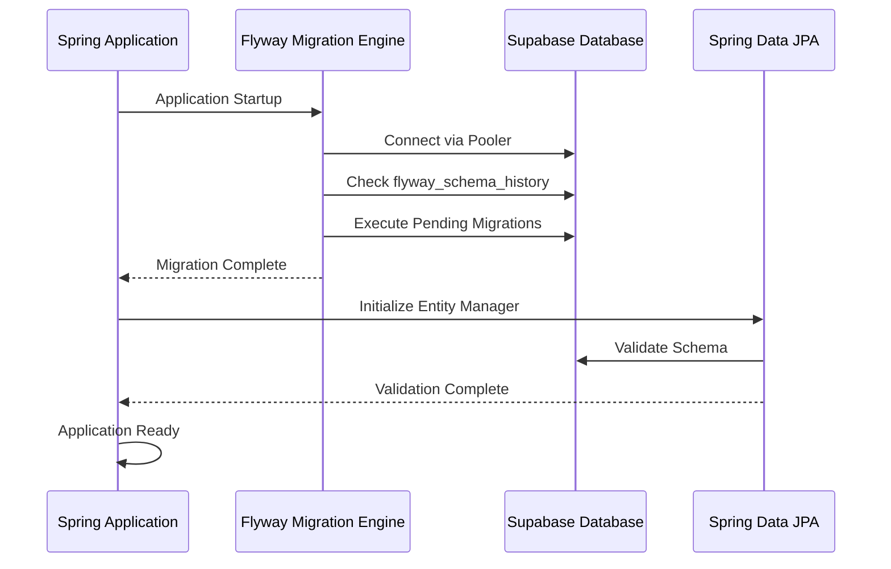

#### Migration Script Structure
Migration scripts will be located in `src/main/resources/db/migration/`:

```
src/main/resources/db/migration/
├── V1__Initial_schema.sql
├── V2__Create_user_tables.sql
├── V3__Add_indexes.sql
└── V4__Insert_reference_data.sql
```

#### Migration Script Naming Convention
- **Format**: `V{version}__{description}.sql`
- **Version**: Sequential number (1, 2, 3...)
- **Description**: Underscore-separated description
- **Example**: `V1__Create_initial_tables.sql`

### Sample Initial Migration Script
```sql
-- V1__Initial_schema.sql
CREATE EXTENSION IF NOT EXISTS "uuid-ossp";

CREATE TABLE users (
    id UUID PRIMARY KEY DEFAULT uuid_generate_v4(),
    username VARCHAR(255) UNIQUE NOT NULL,
    email VARCHAR(255) UNIQUE NOT NULL,
    created_at TIMESTAMP WITH TIME ZONE DEFAULT CURRENT_TIMESTAMP,
    updated_at TIMESTAMP WITH TIME ZONE DEFAULT CURRENT_TIMESTAMP
);

CREATE INDEX idx_users_username ON users(username);
CREATE INDEX idx_users_email ON users(email);
```

## Data Models & JPA Entities

### Base Entity Pattern
All entities will extend a common base entity for audit fields:

```java
@MappedSuperclass
@EntityListeners(AuditingEntityListener.class)
public abstract class BaseEntity {
    @Id
    @GeneratedValue(strategy = GenerationType.UUID)
    private UUID id;
    
    @CreatedDate
    @Column(name = "created_at", nullable = false, updatable = false)
    private LocalDateTime createdAt;
    
    @LastModifiedDate
    @Column(name = "updated_at")
    private LocalDateTime updatedAt;
}
```

### Entity Configuration Standards
- **Primary Keys**: UUID type for global uniqueness
- **Timestamps**: UTC timezone with automatic auditing
- **Validation**: Bean Validation annotations
- **Naming**: Snake_case for database columns, camelCase for Java fields

## Connection Pool Optimization

### HikariCP Configuration for Supabase
Since Supabase uses transaction-level pooling, the application-level pool should be configured conservatively:

```properties
# Optimized for Supabase Transaction Pooling
spring.datasource.hikari.maximum-pool-size=10
spring.datasource.hikari.minimum-idle=5
spring.datasource.hikari.connection-timeout=30000
spring.datasource.hikari.idle-timeout=600000
spring.datasource.hikari.max-lifetime=1800000
spring.datasource.hikari.leak-detection-threshold=60000
```

### Performance Considerations
- **Pool Size**: Limited to 10 connections due to Supabase pooling
- **Connection Lifecycle**: 30-minute maximum lifetime
- **Leak Detection**: 60-second threshold for connection leak detection
- **Idle Timeout**: 10-minute idle connection timeout

## Testing Strategy

### Test Database Configuration
For testing, use H2 in-memory database or Testcontainers with PostgreSQL:

```properties
# application-test.properties
spring.datasource.url=jdbc:h2:mem:testdb
spring.datasource.driver-class-name=org.h2.Driver
spring.jpa.hibernate.ddl-auto=create-drop
spring.flyway.enabled=false
```

### Integration Testing with Testcontainers
```java
@Testcontainers
@SpringBootTest
public class DatabaseIntegrationTest {
    
    @Container
    static PostgreSQLContainer<?> postgres = new PostgreSQLContainer<>("postgres:15")
            .withDatabaseName("testdb")
            .withUsername("test")
            .withPassword("test");
    
    @DynamicPropertySource
    static void configureProperties(DynamicPropertyRegistry registry) {
        registry.add("spring.datasource.url", postgres::getJdbcUrl);
        registry.add("spring.datasource.username", postgres::getUsername);
        registry.add("spring.datasource.password", postgres::getPassword);
    }
}
```

## Monitoring and Health Checks

### Database Health Monitoring
Spring Boot Actuator provides database health checks out of the box:

```properties
# Actuator Configuration
management.endpoints.web.exposure.include=health,info,metrics
management.endpoint.health.show-details=when-authorized
management.health.db.enabled=true
```

### Custom Health Indicator
```java
@Component
public class SupabaseHealthIndicator implements HealthIndicator {
    
    @Autowired
    private DataSource dataSource;
    
    @Override
    public Health health() {
        try (Connection connection = dataSource.getConnection()) {
            if (connection.isValid(10)) {
                return Health.up()
                    .withDetail("database", "Supabase PostgreSQL")
                    .withDetail("status", "Connected")
                    .build();
            }
        } catch (SQLException e) {
            return Health.down()
                .withDetail("error", e.getMessage())
                .build();
        }
        return Health.down().build();
    }
}
```

## Security Considerations

### Connection Security
- **SSL/TLS**: Supabase enfor# Supabase Database Integration Design

## Overview

This document outlines the design for integrating Supabase PostgreSQL database with the qoder-v3 Spring Boot application. The integration includes configuration setup, connection pooling, security considerations, and migration strategies using Flyway for schema management.

**Key Integration Points:**
- Supabase PostgreSQL database connection via JDBC
- Spring Data JPA for ORM operations
- Flyway for database migrations
- Connection pooling optimization for Supabase
- Security configuration for cloud database access

## Technology Stack & Dependencies

### Required Dependencies (Already Present)
```xml
<!-- PostgreSQL JDBC Driver -->
<dependency>
    <groupId>org.postgresql</groupId>
    <artifactId>postgresql</artifactId>
</dependency>

<!-- Spring Data JPA -->
<dependency>
    <groupId>org.springframework.boot</groupId>
    <artifactId>spring-boot-starter-data-jpa</artifactId>
</dependency>

<!-- Flyway Migration -->
<dependency>
    <groupId>org.flywaydb</groupId>
    <artifactId>flyway-core</artifactId>
</dependency>
<dependency>
    <groupId>org.flywaydb</groupId>
    <artifactId>flyway-database-postgresql</artifactId>
</dependency>
```

### Additional Dependencies (Recommended)
```xml
<!-- HikariCP Connection Pool (included in spring-boot-starter-data-jpa) -->
<!-- Validation API for entity constraints -->
<dependency>
    <groupId>org.springframework.boot</groupId>
    <artifactId>spring-boot-starter-validation</artifactId>
</dependency>
```

## Database Configuration

### Environment-Specific Configuration

#### Production Configuration (application-prod.properties)
```properties
# Supabase Database Connection
spring.datasource.url=jdbc:postgresql://aws-1-sa-east-1.pooler.supabase.com:6543/postgres?sslmode=require&pgBouncer=true
spring.datasource.username=postgres.kmcuhicgzwdcalnyywgo
spring.datasource.password=${SUPABASE_DB_PASSWORD}
spring.datasource.driver-class-name=org.postgresql.Driver

# Connection Pool Configuration for Supabase
spring.datasource.hikari.maximum-pool-size=10
spring.datasource.hikari.minimum-idle=2
spring.datasource.hikari.idle-timeout=300000
spring.datasource.hikari.max-lifetime=1200000
spring.datasource.hikari.connection-timeout=20000
spring.datasource.hikari.leak-detection-threshold=60000

# JPA Configuration
spring.jpa.database-platform=org.hibernate.dialect.PostgreSQLDialect
spring.jpa.hibernate.ddl-auto=validate
spring.jpa.show-sql=false
spring.jpa.properties.hibernate.format_sql=true
spring.jpa.properties.hibernate.jdbc.batch_size=20
spring.jpa.properties.hibernate.order_inserts=true
spring.jpa.properties.hibernate.order_updates=true

# Flyway Configuration
spring.flyway.enabled=true
spring.flyway.locations=classpath:db/migration
spring.flyway.baseline-on-migrate=true
spring.flyway.validate-on-migrate=true
```

#### Development Configuration (application-dev.properties)
```properties
# Same Supabase connection for development
spring.datasource.url=jdbc:postgresql://aws-1-sa-east-1.pooler.supabase.com:6543/postgres?sslmode=require&pgBouncer=true
spring.datasource.username=postgres.kmcuhicgzwdcalnyywgo
spring.datasource.password=${SUPABASE_DB_PASSWORD}

# Development-specific settings
spring.jpa.show-sql=true
spring.jpa.hibernate.ddl-auto=validate
spring.datasource.hikari.maximum-pool-size=5
```

### Connection Architecture

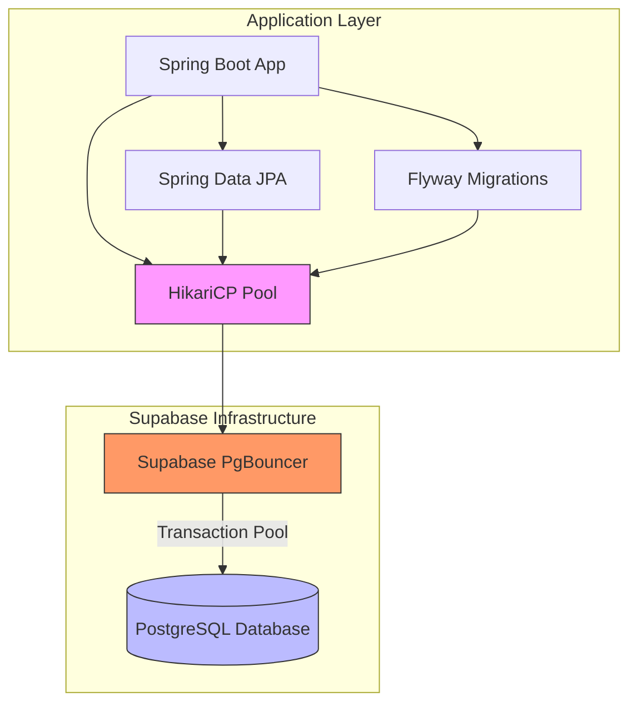

## Data Models & Entity Design

### Base Entity Pattern
```java
@MappedSuperclass
public abstract class BaseEntity {
    @Id
    @GeneratedValue(strategy = GenerationType.IDENTITY)
    private Long id;
    
    @CreationTimestamp
    @Column(name = "created_at", nullable = false, updatable = false)
    private LocalDateTime createdAt;
    
    @UpdateTimestamp
    @Column(name = "updated_at")
    private LocalDateTime updatedAt;
    
    @Version
    private Long version;
}
```

### Example Domain Entities
```java
@Entity
@Table(name = "users")
public class User extends BaseEntity {
    @Column(unique = true, nullable = false)
    private String email;
    
    @Column(nullable = false)
    private String name;
    
    @OneToMany(mappedBy = "user", cascade = CascadeType.ALL)
    private List<Project> projects = new ArrayList<>();
}

@Entity
@Table(name = "projects")
public class Project extends BaseEntity {
    @Column(nullable = false)
    private String title;
    
    @Column(columnDefinition = "TEXT")
    private String description;
    
    @ManyToOne(fetch = FetchType.LAZY)
    @JoinColumn(name = "user_id")
    private User user;
}
```

## Database Migration Strategy

### Migration File Structure
```
src/main/resources/
└── db/
    └── migration/
        ├── V1__Create_initial_schema.sql
        ├── V2__Add_user_table.sql
        ├── V3__Add_project_table.sql
        └── V4__Add_indexes.sql
```

### Initial Schema Migration (V1__Create_initial_schema.sql)
```sql
-- Enable UUID extension
CREATE EXTENSION IF NOT EXISTS "uuid-ossp";

-- Create audit columns function
CREATE OR REPLACE FUNCTION update_updated_at()
RETURNS TRIGGER AS $$
BEGIN
    NEW.updated_at = CURRENT_TIMESTAMP;
    RETURN NEW;
END;
$$ language 'plpgsql';
```

### User Table Migration (V2__Add_user_table.sql)
```sql
CREATE TABLE users (
    id BIGSERIAL PRIMARY KEY,
    email VARCHAR(255) UNIQUE NOT NULL,
    name VARCHAR(255) NOT NULL,
    created_at TIMESTAMP NOT NULL DEFAULT CURRENT_TIMESTAMP,
    updated_at TIMESTAMP DEFAULT CURRENT_TIMESTAMP,
    version BIGINT DEFAULT 0
);

-- Create trigger for updated_at
CREATE TRIGGER update_users_updated_at
    BEFORE UPDATE ON users
    FOR EACH ROW
    EXECUTE FUNCTION update_updated_at();

-- Create indexes
CREATE INDEX idx_users_email ON users(email);
CREATE INDEX idx_users_created_at ON users(created_at);
```

### Migration Execution Flow
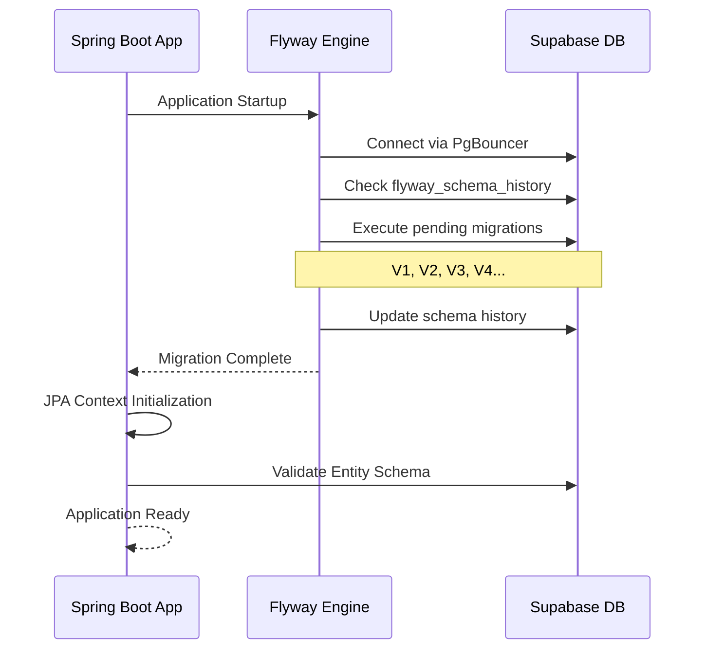

## Security Configuration

### Connection Security
- **SSL Mode**: Required (`sslmode=require`)
- **Connection Pooling**: Transaction-level via PgBouncer
- **Password Management**: Environment variables
- **Network Security**: Supabase managed infrastructure

### Environment Variables Setup
```bash
# Production Environment
export SUPABASE_DB_PASSWORD="Eliasz9172$"
export SPRING_PROFILES_ACTIVE="prod"

# Development Environment
export SUPABASE_DB_PASSWORD="Eliasz9172$"
export SPRING_PROFILES_ACTIVE="dev"
```

### Application# Supabase Database Integration Design

## Overview

This document outlines the design for integrating Supabase (PostgreSQL) database with the qoder-v3 Spring Boot application. The integration includes configuration of database connection, migration setup using Flyway, and optimization for Supabase's pooling architecture.

**Key Objectives:**
- Configure Spring Boot to connect to Supabase PostgreSQL database
- Implement database migration strategy using Flyway
- Optimize connection pooling for Supabase's transaction-mode pooling
- Enable AI capabilities through PostgresML integration
- Ensure secure and performant database operations

## Technology Stack & Dependencies

### Database Infrastructure
- **Database Provider**: Supabase (managed PostgreSQL)
- **Connection Pool**: Transaction-mode pooling via Supabase Pooler
- **Migration Tool**: Flyway for schema version control
- **ORM**: Spring Data JPA with Hibernate

### Required Dependencies
The following dependencies are already configured in `pom.xml`:
```xml
<!-- Database connectivity -->
<dependency>
    <groupId>org.postgresql</groupId>
    <artifactId>postgresql</artifactId>
    <scope>runtime</scope>
</dependency>

<!-- Data access layer -->
<dependency>
    <groupId>org.springframework.boot</groupId>
    <artifactId>spring-boot-starter-data-jpa</artifactId>
</dependency>

<!-- Database migrations -->
<dependency>
    <groupId>org.flywaydb</groupId>
    <artifactId>flyway-core</artifactId>
</dependency>
<dependency>
    <groupId>org.flywaydb</groupId>
    <artifactId>flyway-database-postgresql</artifactId>
</dependency>

<!-- AI capabilities -->
<dependency>
    <groupId>org.springframework.ai</groupId>
    <artifactId>spring-ai-starter-model-postgresml-embedding</artifactId>
</dependency>
```

## Database Configuration

### Connection Properties
The application will be configured to connect to Supabase using the provided connection details:

```properties
# Supabase Database Configuration
spring.datasource.url=jdbc:postgresql://aws-1-sa-east-1.pooler.supabase.com:6543/postgres
spring.datasource.username=postgres.kmcuhicgzwdcalnyywgo
spring.datasource.password=Eliasz9172$
spring.datasource.driver-class-name=org.postgresql.Driver

# Connection Pool Configuration (optimized for Supabase transaction pooling)
spring.datasource.hikari.maximum-pool-size=10
spring.datasource.hikari.minimum-idle=2
spring.datasource.hikari.connection-timeout=20000
spring.datasource.hikari.idle-timeout=300000
spring.datasource.hikari.max-lifetime=1200000
spring.datasource.hikari.leak-detection-threshold=60000

# JPA/Hibernate Configuration
spring.jpa.database-platform=org.hibernate.dialect.PostgreSQLDialect
spring.jpa.hibernate.ddl-auto=validate
spring.jpa.show-sql=false
spring.jpa.properties.hibernate.format_sql=true
spring.jpa.properties.hibernate.jdbc.batch_size=20
spring.jpa.properties.hibernate.order_inserts=true
spring.jpa.properties.hibernate.order_updates=true

# Flyway Configuration
spring.flyway.enabled=true
spring.flyway.locations=classpath:db/migration
spring.flyway.baseline-on-migrate=true
spring.flyway.validate-on-migrate=true
```

### Security Considerations
- Credentials should be externalized using environment variables in production
- Connection uses SSL by default through Supabase
- Transaction-mode pooling provides connection isolation

## Architecture

### Database Connection Flow
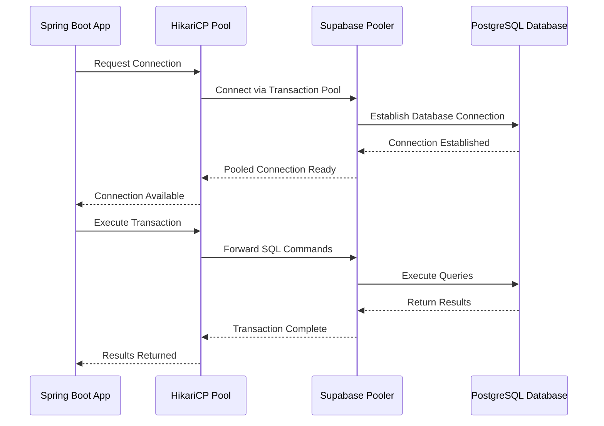

### Application Startup Sequence
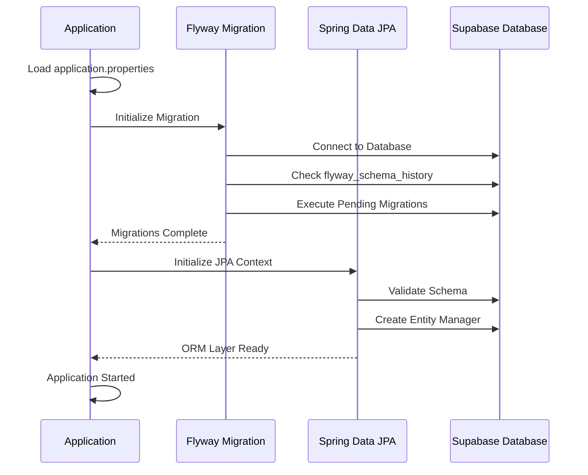

## Migration Strategy

### Flyway Configuration
- **Migration Location**: `src/main/resources/db/migration`
- **Naming Convention**: `V{version}__{description}.sql`
- **Execution**: Automatic on application startup
- **Validation**: Schema validation against JPA entities

### Directory Structure
```
src/main/resources/
└── db/
    └── migration/
        ├── V1__Initial_schema.sql
        ├── V2__Create_users_table.sql
        ├── V3__Create_ai_embeddings_table.sql
        └── V4__Add_indexes.sql
```

### Migration Script Examples

#### V1__Initial_schema.sql
```sql
-- Initial database setup
CREATE EXTENSION IF NOT EXISTS "uuid-ossp";
CREATE EXTENSION IF NOT EXISTS "pgcrypto";

-- Flyway schema history table will be created automatically
```

#### V2__Create_users_table.sql
```sql
-- Users table for authentication
CREATE TABLE users (
    id UUID PRIMARY KEY DEFAULT uuid_generate_v4(),
    email VARCHAR(255) UNIQUE NOT NULL,
    username VARCHAR(100) UNIQUE NOT NULL,
    created_at TIMESTAMP WITH TIME ZONE DEFAULT NOW(),
    updated_at TIMESTAMP WITH TIME ZONE DEFAULT NOW()
);

CREATE INDEX idx_users_email ON users(email);


