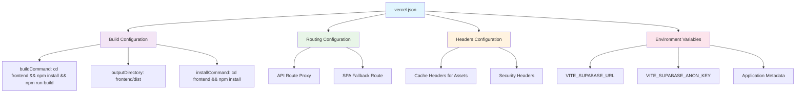
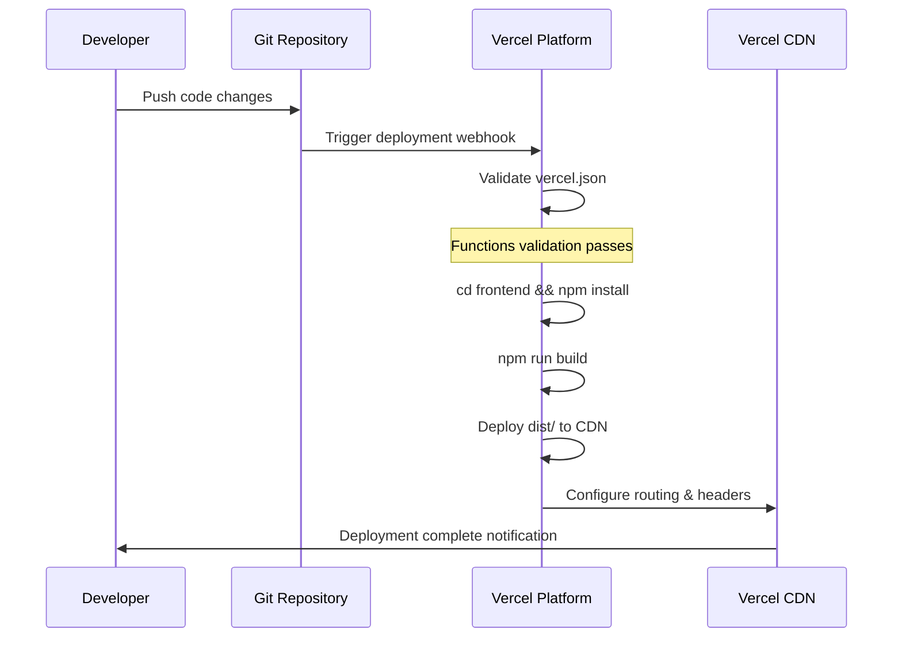

# Vercel Deployment Error Fix Design

## Overview

The deployment to Vercel is failing with the error "functions should not have fewer than 1 properties" due to an invalid `functions` configuration in the `vercel.json` file. This design document outlines the fix for this deployment configuration issue.

## Problem Analysis

### Root Cause
The error occurs because the `vercel.json` file contains an empty `functions` object:
```json
"functions": {}
```

Vercel's configuration validator requires that if a `functions` property is present, it must contain at least one function definition or be omitted entirely.

### Current Configuration Issues
1. Empty `functions` object violating Vercel's schema validation
2. Unnecessary function configuration for a static frontend deployment
3. Configuration mismatch between intended static site deployment and serverless function setup

## Solution Design

### Configuration Fix Strategy

The solution involves removing the empty `functions` property from `vercel.json` since this is a frontend-only deployment that doesn't require serverless functions.

#### Before (Current - Broken)
```json
{
  "name": "qoder-v3-frontend",
  "version": 2,
  "functions": {},
  // ... rest of config
}
```

#### After (Fixed)
```json
{
  "name": "qoder-v3-frontend",
  "version": 2,
  // functions property removed
  // ... rest of config
}
```

### Configuration Architecture



### Deployment Flow



## Implementation Details

### File Modifications Required

1. **vercel.json**: Remove empty `functions` property
2. **Environment Variables**: Ensure proper configuration in Vercel dashboard
3. **Build Process**: Verify frontend build pipeline works correctly

### Testing Strategy

#### Pre-deployment Validation
1. **Local Build Test**:
   ```bash
   cd frontend
   npm install
   npm run build
   ```

2. **Configuration Validation**:
   - Verify vercel.json syntax
   - Test routing configuration
   - Validate environment variables

#### Post-deployment Verification
1. **Functional Testing**:
   - Application loads successfully
   - SPA routing works correctly
   - Supabase authentication functions
   - Static assets serve with correct headers

2. **Performance Testing**:
   - Asset caching verification
   - Security headers validation
   - Core Web Vitals monitoring

### Risk Assessment

| Risk | Impact | Mitigation |
|------|--------|------------|
| Build failure | High | Test build locally before deployment |
| Routing issues | Medium | Verify SPA fallback configuration |
| Environment variable errors | Medium | Validate all required VITE_ variables |
| Cache configuration problems | Low | Monitor asset loading performance |

## Verification Criteria

### Success Metrics
- [ ] Deployment completes without validation errors
- [ ] Application loads at Vercel domain
- [ ] All routes function correctly (/, /login, /register, /dashboard)
- [ ] Supabase integration works
- [ ] Static assets serve with appropriate cache headers
- [ ] Security headers apply correctly

### Error Monitoring
- Monitor Vercel deployment logs
- Check browser console for JavaScript errors
- Verify network requests to Supabase
- Validate CSP compliance

## Alternative Solutions

### Option 1: Function-based Deployment (Not Recommended)
If serverless functions were actually needed, the configuration would require:
```json
"functions": {
  "app/api/*.js": {
    "runtime": "nodejs18.x"
  }
}
```

### Option 2: Build Command Optimization
Alternative build configuration for better performance:
```json
"buildCommand": "cd frontend && npm ci && npm run build"
```

## Rollback Plan

If the deployment fix causes issues:
1. Revert vercel.json changes via git
2. Use Vercel dashboard to promote previous deployment
3. Debug issues in staging environment
4. Re-apply fix with additional testing