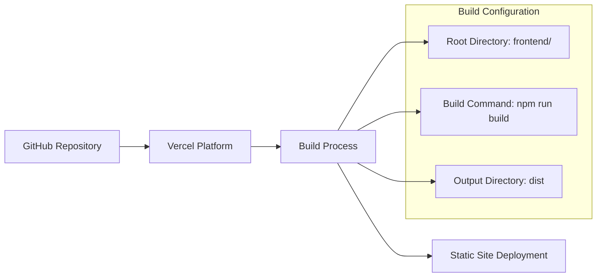
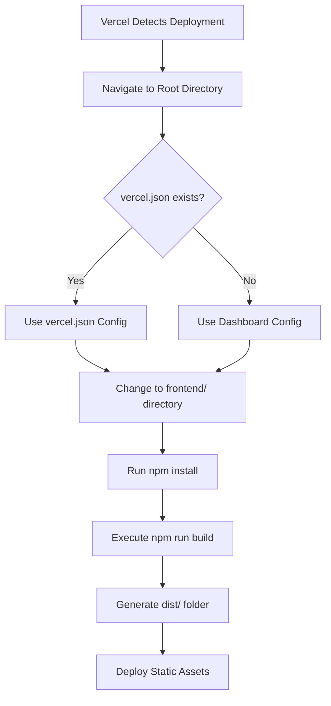
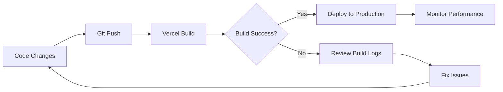

# Deploy Vite Project to Vercel

## Overview

This design document outlines the deployment strategy for the qoder-v3 frontend React application to Vercel. The project is a React 18 application built with Vite, featuring Tailwind CSS styling and Supabase integration. The main challenge is configuring Vercel to properly locate and build the frontend code within the monorepo structure.

## Repository Type Detection

**Repository Type**: Full-Stack Application
- **Frontend**: React 18 with Vite build tool located in `/frontend` directory
- **Backend**: Spring Boot application in root directory
- **Structure**: Monorepo with separate frontend and backend applications

## Deployment Architecture

### Current Project Structure
```
qoder-v3/
├── frontend/                 # React application
│   ├── src/
│   ├── package.json         # Contains "vite build" script
│   ├── vite.config.js       # Vite configuration
│   └── dist/               # Build output directory
├── src/                     # Spring Boot backend
├── pom.xml                  # Backend build configuration
└── README.md
```

### Deployment Target Architecture


## Vercel Configuration Strategy

### Primary Configuration Options

#### Option 1: vercel.json Configuration File
Create a `vercel.json` file in the repository root to specify build settings:

```json
{
  "name": "qoder-v3-frontend",
  "version": 2,
  "buildCommand": "cd frontend && npm install && npm run build",
  "outputDirectory": "frontend/dist",
  "installCommand": "cd frontend && npm install",
  "framework": null,
  "functions": {},
  "routes": [
    {
      "src": "/(.*)",
      "dest": "/index.html"
    }
  ]
}
```

#### Option 2: Vercel Dashboard Configuration
Configure build settings directly in Vercel dashboard:
- **Root Directory**: `frontend`
- **Build Command**: `npm run build`
- **Output Directory**: `dist`
- **Install Command**: `npm install`

### Environment Variables Configuration

#### Required Environment Variables
```
VITE_SUPABASE_URL=your_supabase_url
VITE_SUPABASE_ANON_KEY=your_supabase_anon_key
```

#### Configuration Methods
1. **Vercel Dashboard**: Add variables in Project Settings → Environment Variables
2. **Local Development**: Use `.env.local` file (already present in frontend directory)

## Build Process Analysis

### Current Build Configuration
From `frontend/package.json`:
```json
{
  "scripts": {
    "dev": "vite",
    "build": "vite build",
    "preview": "vite preview"
  }
}
```

### Vite Configuration Analysis
From `frontend/vite.config.js`:
- **Output Directory**: `dist`
- **Source Maps**: Enabled for debugging
- **Development Server**: Port 3000
- **Build Optimizations**: Standard Vite optimizations

### Build Dependencies Resolution


## Error Resolution Strategy

### "vite build not found" Error Analysis
**Root Cause**: Vercel is executing build commands in the repository root where no `package.json` exists, rather than in the `frontend/` directory.

**Solution Methods**:

#### Method 1: Repository Root Configuration
1. Create `vercel.json` in repository root
2. Specify correct build directory and commands
3. Override default framework detection

#### Method 2: Dashboard Override
1. Access Vercel project settings
2. Set "Root Directory" to `frontend`
3. Ensure build command is `npm run build`

#### Method 3: Monorepo Setup
1. Configure Vercel for monorepo structure
2. Use specific path-based deployment
3. Separate build configurations for frontend/backend

## Deployment Steps Implementation

### Step 1: Pre-deployment Verification
```bash
# Verify build works locally
cd frontend
npm install
npm run build
# Confirm dist/ directory is created
```

### Step 2: Vercel Configuration
Choose one configuration method:

**Option A**: Create `vercel.json` in root:
```json
{
  "buildCommand": "cd frontend && npm run build",
  "outputDirectory": "frontend/dist",
  "installCommand": "cd frontend && npm install"
}
```

**Option B**: Configure in Vercel Dashboard:
- Root Directory: `frontend`
- Build Command: `npm run build`
- Output Directory: `dist`

### Step 3: Environment Setup
Add environment variables in Vercel:
- `VITE_SUPABASE_URL`
- `VITE_SUPABASE_ANON_KEY`

### Step 4: Deployment Trigger
1. Push changes to GitHub repository
2. Vercel automatically detects and builds
3. Monitor build logs for success/errors

## Routing Configuration

### Single Page Application Setup
For React Router compatibility:

```json
{
  "routes": [
    {
      "src": "/api/(.*)",
      "dest": "/api/$1"
    },
    {
      "src": "/(.*)",
      "dest": "/index.html"
    }
  ]
}
```

### Static Asset Optimization
```json
{
  "headers": [
    {
      "source": "/static/(.*)",
      "headers": [
        {
          "key": "Cache-Control",
          "value": "public, max-age=31536000, immutable"
        }
      ]
    }
  ]
}
```

## Performance Optimization

### Build Optimization Settings
```javascript
// vite.config.js enhancements
export default defineConfig({
  build: {
    outDir: 'dist',
    sourcemap: true,
    rollupOptions: {
      output: {
        chunkFileNames: 'assets/[name]-[hash].js',
        entryFileNames: 'assets/[name]-[hash].js',
        assetFileNames: 'assets/[name]-[hash].[ext]'
      }
    }
  }
})
```

### Bundle Analysis
- Enable source maps for debugging
- Implement code splitting for better performance
- Optimize asset loading

## Security Considerations

### Environment Variable Security
- Use Vercel's encrypted environment variables
- Separate production and preview environment configs
- Validate all external API endpoints

### Content Security Policy
```json
{
  "headers": [
    {
      "source": "/(.*)",
      "headers": [
        {
          "key": "Content-Security-Policy",
          "value": "default-src 'self'; script-src 'self' 'unsafe-inline'"
        }
      ]
    }
  ]
}
```

## Monitoring and Maintenance

### Deployment Monitoring
- Monitor Vercel deployment logs
- Set up build failure notifications
- Track deployment performance metrics

### Rollback Strategy
- Maintain deployment history
- Configure automatic rollback on failure
- Test deployment in preview environments

### Update Process


## Testing Strategy

### Pre-deployment Testing
```bash
# Local build verification
cd frontend
npm run build
npm run preview

# Environment variable testing
npm run build -- --mode production
```

### Post-deployment Verification
- Verify all routes function correctly
- Test Supabase integration
- Confirm environment variables are loaded
- Validate responsive design

### Automated Testing Integration
- Configure GitHub Actions for pre-deployment testing
- Set up Vercel preview deployments for PR testing
- Implement end-to-end testing with Cypress

## Troubleshooting Guide

### Common Issues and Solutions

#### Issue: "Command not found: vite"
**Solution**: Ensure Vercel is running commands in the correct directory (`frontend/`)

#### Issue: Environment variables not loading
**Solution**: Verify variable names start with `VITE_` prefix

#### Issue: Build succeeds but routing fails
**Solution**: Configure SPA routing in `vercel.json`

#### Issue: Supabase connection errors
**Solution**: Verify environment variables and CORS settings

### Debug Information Collection
- Review Vercel build logs
- Check browser developer console
- Verify network requests to Supabase
- Validate environment variable loading