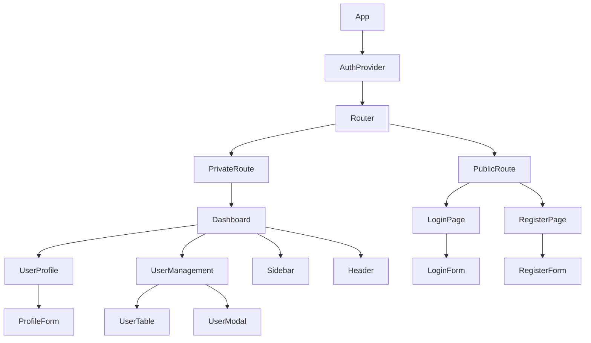
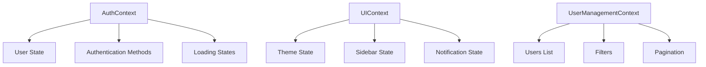

# React User Management System Design

## Overview

This design document outlines a complete React-based user management system with Supabase authentication integration. The system provides login, registration, and dashboard functionality with secure user session management, designed to work independently as a frontend application.

**Core Features:**
- User registration and login with email/password authentication
- Protected dashboard with user profile management
- Secure session handling and JWT token management
- Responsive UI design with modern React patterns
- Initial admin user setup (zarenas/eliasz91$)
- Complete user CRUD operations

**Technology Integration:**
- React 18+ with functional components and hooks
- Supabase for authentication and database
- React Router for navigation and route protection
- Context API for global state management
- Styled-components or Tailwind CSS for styling

## Technology Stack & Dependencies

### Core Frontend Dependencies
```json
{
  "dependencies": {
    "@supabase/supabase-js": "^2.38.0",
    "react": "^18.2.0",
    "react-dom": "^18.2.0",
    "react-router-dom": "^6.8.0",
    "react-hook-form": "^7.43.0",
    "@hookform/resolvers": "^2.9.0",
    "yup": "^1.0.0",
    "react-query": "^3.39.0",
    "lucide-react": "^0.263.1"
  },
  "devDependencies": {
    "@vitejs/plugin-react": "^4.0.0",
    "vite": "^4.3.0",
    "tailwindcss": "^3.3.0",
    "autoprefixer": "^10.4.0",
    "postcss": "^8.4.0"
  }
}
```

### Development Environment Setup
- Node.js 18+ and npm/yarn package manager
- Vite for build tooling and development server
- ESLint and Prettier for code quality
- Supabase CLI for local development and deployment

## Component Architecture

### Component Hierarchy


### Core Components Definition

#### 1. App Component
**Purpose:** Root component providing global context and routing setup
**Props:** None
**State:** Global authentication state, theme preferences
**Key Features:**
- Initializes Supabase client
- Provides authentication context
- Sets up routing configuration
- Handles global error boundaries

#### 2. AuthProvider Component
**Purpose:** Manages authentication state and provides auth methods
**Props:** children (ReactNode)
**State:** 
- user: User object or null
- loading: boolean for auth loading state
- error: string for auth errors

**Methods:**
- signIn(email, password)
- signUp(email, password, metadata)
- signOut()
- updateProfile(data)
- resetPassword(email)

#### 3. LoginPage & LoginForm
**Purpose:** User authentication interface
**Props:** LoginForm receives onSubmit callback
**State:** Form data (email, password), loading, errors
**Validation Rules:**
- Email: Required, valid email format
- Password: Required, minimum 6 characters
**Features:**
- Form validation with react-hook-form
- Loading states and error handling
- "Remember me" functionality
- Password reset link

#### 4. RegisterPage & RegisterForm  
**Purpose:** New user registration interface
**Props:** RegisterForm receives onSubmit callback
**State:** Form data (email, password, confirmPassword, profile info)
**Validation Rules:**
- Email: Required, valid email format, uniqueness check
- Password: Required, minimum 8 characters, complexity rules
- Confirm Password: Must match password
- Username: Required, 3-50 characters, alphanumeric + underscore

#### 5. Dashboard Component
**Purpose:** Main authenticated user interface
**Props:** None (receives user from context)
**State:** Active view, notifications
**Features:**
- User statistics overview
- Navigation sidebar
- Profile management access
- User management (admin users only)

#### 6. UserManagement Component
**Purpose:** Admin interface for managing all users
**Props:** None
**State:** Users list, filters, pagination, selected user
**Features:**
- User search and filtering
- User status management (active/inactive/suspended)
- User role assignment
- Bulk operations
- User creation/deletion

## Routing & Navigation

### Route Configuration
``javascript
const routes = [
  {
    path: '/',
    element: <PublicRoute />,
    children: [
      { index: true, element: <Navigate to="/login" /> },
      { path: 'login', element: <LoginPage /> },
      { path: 'register', element: <RegisterPage /> },
      { path: 'reset-password', element: <ResetPasswordPage /> }
    ]
  },
  {
    path: '/dashboard',
    element: <PrivateRoute />,
    children: [
      { index: true, element: <Dashboard /> },
      { path: 'profile', element: <UserProfile /> },
      { path: 'users', element: <UserManagement /> },
      { path: 'settings', element: <Settings /> }
    ]
  }
];
```

### Route Protection Strategy
- **PublicRoute:** Redirects authenticated users to dashboard
- **PrivateRoute:** Requires authentication, redirects to login if not authenticated
- **Role-based Access:** Admin routes protected by user role checks
- **Persistent Sessions:** Auto-redirect based on stored authentication state

## Styling Strategy

### Tailwind CSS Integration
**Base Configuration:**
- Responsive design with mobile-first approach
- Custom color palette matching brand guidelines
- Component-based utility classes
- Dark/light theme support

**Component Styling Patterns:**
```css
/* Form Components */
.form-input {
  @apply w-full px-3 py-2 border border-gray-300 rounded-md focus:outline-none focus:ring-2 focus:ring-blue-500;
}

.btn-primary {
  @apply bg-blue-600 text-white px-4 py-2 rounded-md hover:bg-blue-700 focus:outline-none focus:ring-2 focus:ring-blue-500;
}

/* Layout Components */
.sidebar {
  @apply fixed left-0 top-0 w-64 h-full bg-gray-900 text-white transform transition-transform;
}

.main-content {
  @apply ml-64 p-6 min-h-screen bg-gray-50;
}
```

## State Management

### Context API Architecture


### Authentication Context
**State Structure:**
```typescript
interface AuthState {
  user: User | null;
  session: Session | null;
  loading: boolean;
  error: string | null;
}

interface AuthContextValue extends AuthState {
  signIn: (email: string, password: string) => Promise<void>;
  signUp: (email: string, password: string, metadata?: object) => Promise<void>;
  signOut: () => Promise<void>;
  updateProfile: (data: Partial<User>) => Promise<void>;
  resetPassword: (email: string) => Promise<void>;
}
```

### Global State Management
- **Authentication State:** User session, profile data, permissions
- **UI State:** Theme preferences, sidebar visibility, notifications
- **Application State:** Route history, form states, temporary data
- **Cache Management:** React Query for server state and caching

## API Integration Layer

### Supabase Client Configuration
```javascript
const supabaseConfig = {
  url: process.env.REACT_APP_SUPABASE_URL,
  anonKey: process.env.REACT_APP_SUPABASE_ANON_KEY,
  options: {
    auth: {
      autoRefreshToken: true,
      persistSession: true,
      detectSessionInUrl: true
    }
  }
};
```

### Authentication API Methods
```javascript
class AuthService {
  // User Registration
  async signUp(email, password, userData) {
    const { data, error } = await supabase.auth.signUp({
      email,
      password,
      options: {
        data: {
          username: userData.username,
          first_name: userData.firstName,
          last_name: userData.lastName
        }
      }
    });
    return { data, error };
  }

  // User Login
  async signIn(email, password) {
    const { data, error } = await supabase.auth.signInWithPassword({
      email,
      password
    });
    return { data, error };
  }

  // Profile Updates
  async updateProfile(userId, updates) {
    const { data, error } = await supabase
      .from('users')
      .update(updates)
      .eq('id', userId)
      .select();
    return { data, error };
  }

  // Password Reset
  async resetPassword(email) {
    const { data, error } = await supabase.auth.resetPasswordForEmail(email);
    return { data, error };
  }
}
```

### Database Schema Integration
```sql
-- Users table structure (matching backend entity)
CREATE TABLE users (
    id UUID PRIMARY KEY DEFAULT gen_random_uuid(),
    username VARCHAR(50) UNIQUE NOT NULL,
    email VARCHAR(255) UNIQUE NOT NULL,
    first_name VARCHAR(100),
    last_name VARCHAR(100),
    full_name VARCHAR(255),
    avatar_url TEXT,
    bio TEXT,
    github_username VARCHAR(50),
    status VARCHAR(20) DEFAULT 'ACTIVE',
    email_verified BOOLEAN DEFAULT FALSE,
    last_login_at TIMESTAMPTZ,
    created_at TIMESTAMPTZ DEFAULT NOW(),
    updated_at TIMESTAMPTZ DEFAULT NOW()
);

-- Row Level Security (RLS) policies
ALTER TABLE users ENABLE ROW LEVEL SECURITY;

CREATE POLICY "Users can read their own data" ON users
    FOR SELECT USING (auth.uid() = id);

CREATE POLICY "Users can update their own data" ON users
    FOR UPDATE USING (auth.uid() = id);
```

## Testing Strategy

### Component Testing with Jest & React Testing Library
```javascript
// Example test for LoginForm component
describe('LoginForm', () => {
  test('validates required fields', async () => {
    render(<LoginForm onSubmit={jest.fn()} />);
    
    const submitButton = screen.getByRole('button', { name: /sign in/i });
    fireEvent.click(submitButton);
    
    expect(await screen.findByText(/email is required/i)).toBeInTheDocument();
    expect(await screen.findByText(/password is required/i)).toBeInTheDocument();
  });

  test('calls onSubmit with form data', async () => {
    const mockSubmit = jest.fn();
    render(<LoginForm onSubmit={mockSubmit} />);
    
    fireEvent.change(screen.getByLabelText(/email/i), {
      target: { value: 'test@example.com' }
    });
    fireEvent.change(screen.getByLabelText(/password/i), {
      target: { value: 'password123' }
    });
    
    fireEvent.click(screen.getByRole('button', { name: /sign in/i }));
    
    await waitFor(() => {
      expect(mockSubmit).toHaveBeenCalledWith({
        email: 'test@example.com',
        password: 'password123'
      });
    });
  });
});
```

### Integration Testing
- **Authentication Flow:** Complete login/logout cycles
- **Form Submissions:** Registration and profile update workflows  
- **Route Protection:** Access control and redirects
- **API Integration:** Supabase authentication methods

### End-to-End Testing
- **User Registration:** Complete signup process including email verification
- **Login Flow:** Authentication and dashboard access
- **Profile Management:** Update user information and avatar
- **Admin Functions:** User management operations for admin users

## Architecture

### Application Flow Diagram
``mermaid
sequenceDiagram
    participant U as User
    participant R as React App
    participant S as Supabase Auth
    participant DB as Supabase DB
    
    U->>R: Access application
    R->>S: Check existing session
    S-->>R: Session status
    
    alt Not authenticated
        R->>U: Redirect to login
        U->>R: Submit credentials
        R->>S: signInWithPassword()
        S->>DB: Validate credentials
        DB-->>S: User data
        S-->>R: Session + User
        R->>U: Redirect to dashboard
    else Authenticated
        R->>U: Show dashboard
    end
    
    U->>R: Update profile
    R->>DB: Update user record
    DB-->>R: Updated data
    R->>U: Show success message
```

### Data Flow Architecture
``mermaid
graph LR
    A[User Input] --> B[React Form]
    B --> C[Validation Layer]
    C --> D[API Service]
    D --> E[Supabase Client]
    E --> F[Authentication]
    E --> G[Database]
    F --> H[Session Storage]
    G --> I[User Profile]
    H --> J[Context State]
    I --> J
    J --> K[UI Components]
```

### Security Architecture
- **Authentication:** JWT tokens managed by Supabase Auth
- **Authorization:** Row Level Security (RLS) policies in database
- **Session Management:** Automatic token refresh and secure storage
- **Input Validation:** Client-side validation with server-side enforcement
- **HTTPS Only:** All communication encrypted in production
- **CSRF Protection:** Built into Supabase client configuration

## Initial User Configuration

### Default Admin User Setup
The system will be initialized with the following admin user:

**User Credentials:**
- Username: zarenas
- Email: zabdieljr2@gmail.com  
- Password: eliasz91$
- Role: Administrator
- Status: ACTIVE
- Email Verified: true

**Setup Process:**
1. Create admin user during application initialization
2. Set appropriate permissions and role assignments
3. Configure dashboard access and user management privileges
4. Generate secure session for immediate access

### User Roles & Permissions
```javascript
const userRoles = {
  ADMIN: {
    permissions: ['USER_CREATE', 'USER_READ', 'USER_UPDATE', 'USER_DELETE', 'SYSTEM_MANAGE']
  },
  USER: {
    permissions: ['PROFILE_READ', 'PROFILE_UPDATE']
  }
};
```

## Testing

### Unit Testing Strategy
- **Components:** Test rendering, props handling, and user interactions
- **Hooks:** Test custom hooks with React Testing Library
- **Services:** Mock Supabase client and test API integration
- **Utilities:** Test helper functions and validation logic

### Integration Testing Coverage  
- **Authentication Flow:** Complete login/registration cycles
- **Protected Routes:** Access control verification
- **Form Handling:** Validation and submission workflows
- **State Management:** Context updates and component synchronization
