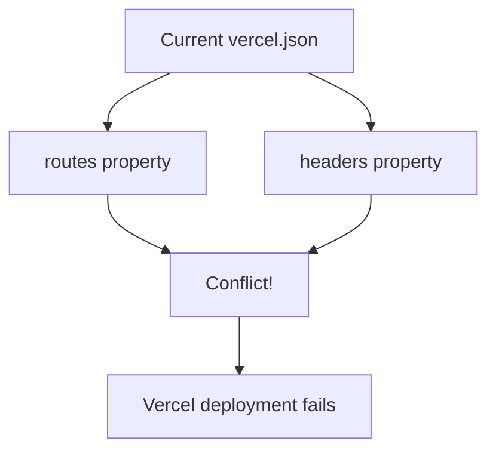
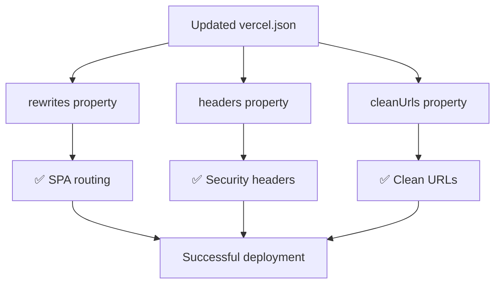
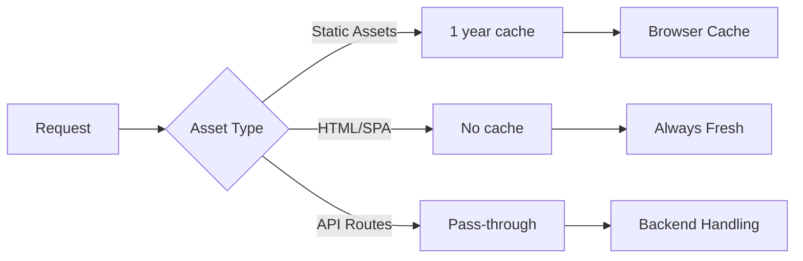
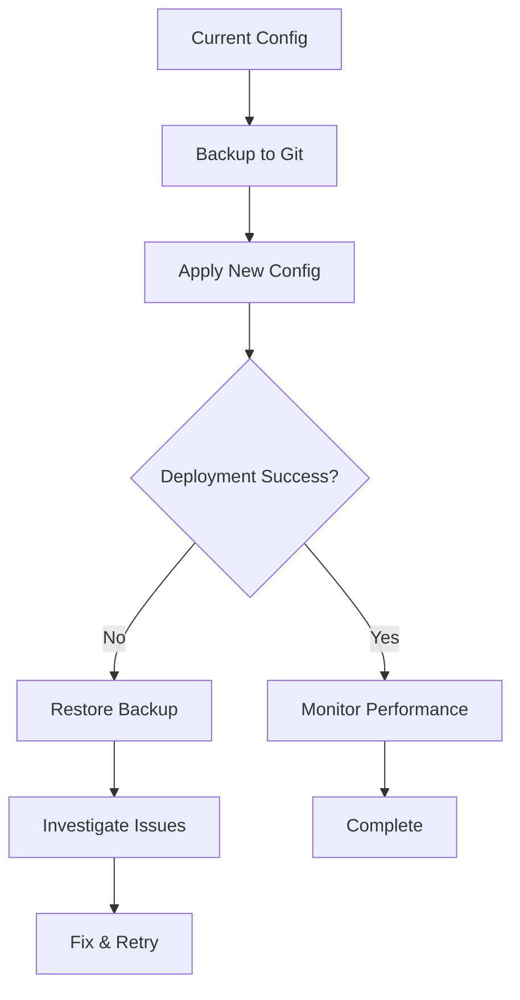

# Vercel Configuration Conflict Resolution Design

## Overview

This design addresses the Vercel deployment error: "If rewrites, redirects, headers, cleanUrls or trailingSlash are used, then routes cannot be present." The current `vercel.json` configuration contains both `routes` and `headers` properties, which creates a conflict in Vercel's newer configuration system.

## Architecture

### Current Problem Analysis



The current configuration uses the legacy `routes` property alongside the modern `headers` property, causing Vercel to reject the deployment.

### Target Architecture



## Configuration Migration Strategy

### Legacy vs Modern Configuration

| Legacy Property | Modern Equivalent | Purpose |
|----------------|------------------|---------|
| `routes` | `rewrites` | URL routing and fallbacks |
| N/A | `headers` | HTTP security headers |
| N/A | `cleanUrls` | Remove .html extensions |

### Updated Configuration Structure

```json
{
  "name": "qoder-v3-frontend",
  "version": 2,
  "buildCommand": "cd frontend && npm install && npm run build",
  "outputDirectory": "frontend/dist",
  "installCommand": "cd frontend && npm install",
  "framework": null,
  "rewrites": [
    {
      "source": "/api/(.*)",
      "destination": "/api/$1"
    },
    {
      "source": "/(.*)",
      "destination": "/index.html"
    }
  ],
  "headers": [
    {
      "source": "/static/(.*)",
      "headers": [
        {
          "key": "Cache-Control",
          "value": "public, max-age=31536000, immutable"
        }
      ]
    },
    {
      "source": "/assets/(.*)",
      "headers": [
        {
          "key": "Cache-Control",
          "value": "public, max-age=31536000, immutable"
        }
      ]
    },
    {
      "source": "/(.*)",
      "headers": [
        {
          "key": "Content-Security-Policy",
          "value": "default-src 'self'; script-src 'self' 'unsafe-inline' 'unsafe-eval'; style-src 'self' 'unsafe-inline'; img-src 'self' data: https:; connect-src 'self' https://kmcuhicgzwdcalnyywgo.supabase.co; font-src 'self';"
        },
        {
          "key": "X-Content-Type-Options",
          "value": "nosniff"
        },
        {
          "key": "X-Frame-Options",
          "value": "DENY"
        },
        {
          "key": "X-XSS-Protection",
          "value": "1; mode=block"
        }
      ]
    }
  ],
  "cleanUrls": true,
  "env": {
    "VITE_SUPABASE_URL": "@vite_supabase_url",
    "VITE_SUPABASE_ANON_KEY": "@vite_supabase_anon_key",
    "VITE_APP_NAME": "Qoder V3 - User Management",
    "VITE_APP_VERSION": "1.0.0"
  }
}
```

## Security & Performance Configuration

### Headers Strategy

| Header | Purpose | Implementation |
|--------|---------|----------------|
| Content-Security-Policy | XSS protection | Restrict script/style sources |
| X-Content-Type-Options | MIME sniffing protection | `nosniff` |
| X-Frame-Options | Clickjacking protection | `DENY` |
| X-XSS-Protection | Legacy XSS protection | `1; mode=block` |
| Cache-Control | Asset caching | Long-term for static assets |

### Caching Strategy



## Testing Strategy

### Deployment Verification Matrix

| Test Case | Expected Result | Verification Method |
|-----------|----------------|-------------------|
| Root path `/` | Serves index.html | `curl -I https://app.vercel.app/` |
| SPA routes `/login` | Serves index.html | `curl -I https://app.vercel.app/login` |
| Static assets | Cached headers | Check Cache-Control header |
| Security headers | CSP, X-Frame-Options present | Browser dev tools |
| API routes | Pass-through working | Network tab inspection |

### Pre-deployment Testing

```bash
# Local build verification
cd frontend
npm install
npm run build
ls -la dist/

# Configuration validation
vercel --help
vercel dev --debug
```

### Post-deployment Testing

```bash
# Test main routes
curl -I https://your-app.vercel.app
curl -I https://your-app.vercel.app/login
curl -I https://your-app.vercel.app/dashboard

# Verify headers
curl -I https://your-app.vercel.app/assets/index.css
```

## Rollback Strategy

### Configuration Backup



### Emergency Rollback Steps

1. **Immediate Rollback**: Use Vercel dashboard to promote previous deployment
2. **Configuration Rollback**: Restore `vercel.json` from git history
3. **Verification**: Test all critical paths after rollback
4. **Issue Analysis**: Review build logs and error messages

## Implementation Steps

### Phase 1: Configuration Update
1. Backup current `vercel.json`
2. Replace `routes` with `rewrites`
3. Add `cleanUrls: true`
4. Validate JSON syntax

### Phase 2: Deployment
1. Commit configuration changes
2. Trigger Vercel deployment
3. Monitor build logs
4. Verify functionality

### Phase 3: Validation
1. Test all SPA routes
2. Verify security headers
3. Check asset caching
4. Monitor performance metrics

## Risk Mitigation

### Potential Issues & Solutions

| Risk | Impact | Mitigation |
|------|--------|------------|
| SPA routing broken | High | Test all routes post-deployment |
| Headers not applied | Medium | Verify with browser dev tools |
| Build failures | High | Test build locally first |
| Performance regression | Low | Monitor Core Web Vitals |

### Monitoring Strategy

- **Build Monitoring**: Vercel build logs and notifications
- **Performance Monitoring**: Vercel Analytics and Core Web Vitals
- **Error Monitoring**: Browser console and network errors
- **Uptime Monitoring**: Regular health checks on critical paths